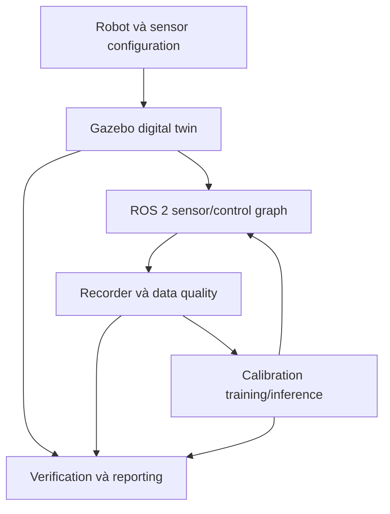

# P01 — Intelligent Robot Digital Twin Foundation

## 1. Thông tin project

- **Mã project:** P01
- **Tên project:** Intelligent Robot Digital Twin Foundation
- **Thời gian:** Tuần 1–8, từ **14/09/2026 đến 08/11/2026**
- **Hướng phát triển:** Humanoid AI Perception kết hợp Humanoid Robot Control & Simulation
- **Thành viên A:** Machine Learning, dữ liệu cảm biến và sensor calibration
- **Thành viên B:** Modern Robotics, ROS 2, URDF/Xacro, Gazebo và control interface cơ bản
- **Project kế tiếp:** P02 — Perception, State Estimation & Control Workbench

## 2. Project giải quyết vấn đề gì?

P01 xây nền tảng digital twin cho một upper-body humanoid có base cố định. Robot gồm đầu, hai tay, camera, IMU, encoder và cảm biến khoảng cách; mô hình chạy trong Gazebo và trao đổi dữ liệu qua ROS 2. Project đồng thời xây data pipeline có kiểm soát và một sensor calibration service để dữ liệu mô phỏng có thể được P02 sử dụng ngay.

### Công dụng

- Tạo robot description thống nhất giữa RViz2, Gazebo, TF2 và ros2_control.
- Tạo nguồn dữ liệu cảm biến có ground truth, timestamp, frame và đơn vị rõ ràng.
- Phát hiện dữ liệu thiếu, trùng, sai đơn vị, ngoài miền và không đồng bộ.
- Huấn luyện, lưu version và chạy inference cho mô hình hiệu chỉnh cảm biến khoảng cách.
- Cung cấp robot model, topics, manifests, calibrated range và test scenarios cho P02.

### Input tổng thể

| Input | Dạng | Ví dụ |
|---|---|---|
| Robot specification | YAML/Xacro | 8 DOF, link dimensions, mass, joint limits |
| Simulation configuration | YAML/SDF | physics step, sensor noise, target distance |
| Joint command | `trajectory_msgs/msg/JointTrajectory` | `head_pan_joint: 0 → 0.5 rad trong 2 s` |
| Sensor streams | ROS 2 messages | joint state, IMU, RGB image và raw range |
| Ground truth | ROS 2 message | khoảng cách thật từ `base_link`, đơn vị mét |
| Data command | CLI | collect, validate, split, train, evaluate, serve |

### Output tổng thể

| Output | Topic/artifact | Nội dung |
|---|---|---|
| Robot state | `/joint_states` | joint position, velocity và effort |
| Sensor streams | `/imu/data`, `/camera/front/image_raw`, `/range/raw` | dữ liệu sensor có timestamp/frame |
| Calibrated range | `/range/calibrated` | khoảng cách đã hiệu chỉnh và model version |
| Dataset metadata | `data/dataset_manifest.json` | URI, checksum, schema version và thống kê |
| Split metadata | `data/split_manifest.json` | session thuộc train/validation/test |
| Model metadata | `models/registry.json` | active model, checksum, feature schema và metrics |
| Báo cáo nghiệm thu | `docs/verification.md` | data quality, calibration, simulation và interface results |

### Người/module sử dụng kết quả

- P02 perception pipeline dùng RGB, range, joint state và TF tree.
- P02 state estimator dùng IMU, joint state, calibrated range và covariance/quality flags.
- P02 controller dùng robot description, joint limits và ros2_control interface.
- Hai thành viên dùng CLI và runbook để tái tạo dataset, model và demo.

### Giới hạn và ngoài phạm vi

- Upper-body humanoid khoảng 8 DOF và base cố định; chưa có locomotion hoặc balance.
- Chỉ hiệu chỉnh một cảm biến khoảng cách; chưa fusion nhiều sensor.
- ros2_control chỉ ở mức state/command interface và trajectory cơ bản.
- Chỉ chạy simulation; không điều khiển motor thật và không chứng nhận an toàn.
- Chưa triển khai classification, Deep Learning, tracking, Kalman Filter, PID/LQR nâng cao, VLM hoặc VLA.

### Điều kiện bắt đầu

- Có Ubuntu/WSL phù hợp, ROS 2 Jazzy, Gazebo Harmonic, Python và C++ toolchain.
- Hai thành viên thống nhất 8 DOF và phạm vi upper body.
- Có Git repository dùng chung và quy ước branch/commit.

### Tiêu chí kết thúc

- URDF/Xacro parse được, TF tree không có vòng/orphan và robot spawn ổn định.
- Sensor topics đúng message, frame, unit, rate và timeout policy.
- Data pipeline tạo raw dataset, quality report và split không leakage.
- Calibration model có version, feature schema, metrics và chạy được online.
- Unit, contract, integration và system tests đều pass.

## 3. Architecture



### Module và interface

| Module | Input | Output | Xử lý lỗi |
|---|---|---|---|
| `robot_description` | Xacro properties, joints, sensor poses | URDF, TF tree, collision/inertial model | Không spawn khi Xacro/URDF invalid |
| `simulation` | robot model, world, noise profile | sensor streams và ground truth | Dừng scenario nếu sensor plugin không khởi tạo |
| `ros2_runtime` | ROS topics | synchronized records và health events | Đánh dấu stale/timeout, không tạo dữ liệu giả |
| `data_quality` | records + schema | valid rows, quarantine và quality summary | Giữ raw bất biến; lỗi có error code |
| `calibration` | train split + raw range | model version, prediction và metrics | Từ chối model/schema mismatch |
| `control_interface` | joint trajectory | joint states và execution result | Reject sai joint name/limit |
| `evaluation` | logs, manifests, ground truth | verification report | Báo thiếu evidence thay vì tự suy đoán |

### ROS 2 interface

| Topic | Message type | Rate | Frame/đơn vị |
|---|---|---:|---|
| `/joint_states` | `sensor_msgs/msg/JointState` | 50 Hz | joint names; rad, rad/s, N·m |
| `/imu/data` | `sensor_msgs/msg/Imu` | 100 Hz | `imu_link`; quaternion, rad/s, m/s² |
| `/camera/front/image_raw` | `sensor_msgs/msg/Image` | 30 Hz | `camera_front_optical_frame`; RGB8 640×480 |
| `/range/raw` | `sensor_msgs/msg/Range` | 20 Hz | `range_link`; m |
| `/range/calibrated` | `sensor_msgs/msg/Range` | 20 Hz | `range_link`; m; model version trong diagnostics |
| `/ground_truth/object_distance` | `std_msgs/msg/Float64` | 20 Hz | `base_link`; m; chỉ dùng train/evaluate |
| `/joint_command` | `trajectory_msgs/msg/JointTrajectory` | theo lệnh | joint names; rad, s |

### CSV mẫu

```csv
timestamp_ns,session_id,sequence_id,head_pan_rad,left_shoulder_rad,right_shoulder_rad,imu_w_rad_s,imu_ax_m_s2,range_raw_m,range_valid,camera_ok,ground_truth_distance_m,environment_label
1726290000000000000,run_001,seq_001,0.00,0.25,-0.25,0.01,9.80,1.184,true,true,1.200,lab_clear
1726290000050000000,run_001,seq_001,0.01,0.26,-0.24,0.02,9.79,1.139,true,true,1.150,lab_clear
```

### Quy tắc lỗi, logging và configuration

- Topic không xuất hiện trong 5 giây: `TOPIC_TIMEOUT`; record quá 100 ms: `STALE_SAMPLE`.
- Timestamp đi lùi: `NON_MONOTONIC_TIMESTAMP`; frame/unit sai: `INTERFACE_MISMATCH`.
- NaN/Inf và range ngoài `[0.10, 5.00] m` được đưa vào quarantine; không thay missing bằng `0`.
- Raw dataset là immutable; mọi bước cleaning tạo dataset version mới và giữ lineage.
- Mọi run ghi config snapshot, Git commit, seed, dataset/model checksum, latency và error code.
- Parameter thay đổi được phải nằm trong YAML; không hard-code topic, frame, limit hoặc model path.

## 4. Cấu trúc repository chuyên nghiệp

Repository không chứa notebook, file bài tập, báo cáo theo tuần hoặc nhiều script thử nghiệm rời rạc. Business logic nằm trong `p01_core`; ROS 2 packages chỉ làm runtime/robot integration; toàn bộ collect, validate, split, train, evaluate và run đi qua một CLI thống nhất.

Dataset bytes, rosbag, checkpoint, runtime log, video và plot là artefact sinh ra khi chạy nên không nằm trong Git tree. Vị trí lưu được cấu hình trong `configs/workbench.yaml`; repository chỉ version-control manifest, checksum, model registry và báo cáo nghiệm thu.

```text
p01_intelligent_robot_digital_twin/
├── README.md
├── LICENSE
├── CONTRIBUTING.md
├── pyproject.toml
├── requirements.lock
├── .editorconfig
├── .gitignore
├── .pre-commit-config.yaml
├── .github/
│   └── workflows/
│       └── ci.yaml
├── docs/
│   ├── architecture.md
│   ├── interfaces.md
│   ├── robot_specification.md
│   ├── verification.md
│   └── runbook.md
├── configs/
│   ├── workbench.yaml
│   ├── joints.yaml
│   ├── sensors.yaml
│   ├── simulation.yaml
│   └── calibration.yaml
├── data/
│   ├── README.md
│   ├── dataset_manifest.json
│   ├── split_manifest.json
│   └── schema.json
├── models/
│   ├── README.md
│   └── registry.json
├── src/
│   └── p01_core/
│       ├── __init__.py
│       ├── config.py
│       ├── contracts.py
│       ├── errors.py
│       ├── logging.py
│       ├── data/
│       │   ├── __init__.py
│       │   ├── dataset.py
│       │   └── quality.py
│       ├── geometry/
│       │   ├── __init__.py
│       │   ├── transforms.py
│       │   └── kinematics.py
│       ├── calibration/
│       │   ├── __init__.py
│       │   ├── model.py
│       │   ├── optimization.py
│       │   └── service.py
│       └── evaluation/
│           ├── __init__.py
│           ├── metrics.py
│           └── report.py
├── ros2_ws/
│   └── src/
│       ├── p01_robot_description/
│       │   ├── CMakeLists.txt
│       │   ├── package.xml
│       │   ├── urdf/
│       │   │   ├── upper_body.urdf.xacro
│       │   │   ├── common.xacro
│       │   │   ├── arms.xacro
│       │   │   ├── sensors.xacro
│       │   │   └── ros2_control.xacro
│       │   ├── meshes/README.md
│       │   └── rviz/p01.rviz
│       ├── p01_simulation/
│       │   ├── CMakeLists.txt
│       │   ├── package.xml
│       │   ├── worlds/lab.sdf
│       │   ├── models/target_box/model.sdf
│       │   ├── config/bridge.yaml
│       │   └── launch/simulation.launch.py
│       ├── p01_runtime/
│       │   ├── package.xml
│       │   ├── setup.py
│       │   └── p01_runtime/
│       │       ├── recorder_node.py
│       │       ├── quality_monitor_node.py
│       │       └── calibration_node.py
│       └── p01_bringup/
│           ├── package.xml
│           ├── launch/digital_twin.launch.py
│           └── config/controllers.yaml
├── tools/
│   └── p01.py
├── tests/
│   ├── unit/
│   │   ├── test_data.py
│   │   ├── test_geometry.py
│   │   └── test_calibration.py
│   ├── contract/
│   │   ├── test_interfaces.py
│   │   └── test_robot_model.py
│   ├── integration/
│   │   └── test_data_pipeline.py
│   └── system/
│       └── test_digital_twin.py
└── deploy/
    ├── Dockerfile
    └── compose.yaml
```

### Trách nhiệm của từng file và folder

| Đường dẫn | Trách nhiệm trong sản phẩm |
|---|---|
| `README.md` | Hướng dẫn duy nhất để cài đặt, build, launch, collect, train, evaluate và demo. |
| `LICENSE` | Quy định quyền sử dụng và phân phối mã nguồn. |
| `CONTRIBUTING.md` | Quy ước branch, commit, code style, test và pull request. |
| `pyproject.toml` | Khai báo package `p01_core`, dependencies, CLI, formatter, linter và pytest. |
| `requirements.lock` | Khóa dependency để máy hai thành viên, CI và container cho cùng kết quả. |
| `.editorconfig` | Đồng nhất encoding, indent và newline giữa editor. |
| `.gitignore` | Không commit dataset bytes, checkpoint, ROS build artefact, logs và secret. |
| `.pre-commit-config.yaml` | Tự động chạy format, lint và file checks trước commit. |
| `.github/workflows/ci.yaml` | Build Python/ROS packages và chạy unit/contract tests trên mỗi push/PR. |
| `docs/architecture.md` | Module boundary, data flow, runtime view và failure path. |
| `docs/interfaces.md` | Topic, message, CSV schema, frame, unit, rate, QoS và timeout. |
| `docs/robot_specification.md` | DOF, link/joint tree, dimensions, mass, inertia, limits và sensor poses. |
| `docs/verification.md` | Acceptance metrics, test evidence, calibration results và known limitations. |
| `docs/runbook.md` | Cách vận hành, chẩn đoán lỗi, tái tạo dataset/model và rollback. |
| `configs/workbench.yaml` | Profile tổng, artifact root, namespace, seed và feature flags. |
| `configs/joints.yaml` | Joint order, type, axis, limits và default pose. |
| `configs/sensors.yaml` | Sensor topic, pose, rate, range, noise và calibration fields. |
| `configs/simulation.yaml` | World, physics timestep, solver, target positions và scenario seed. |
| `configs/calibration.yaml` | Feature order, model method, split policy, learning rate và thresholds. |
| `data/README.md` | Nguồn dữ liệu, license, schema, lineage và nơi lưu bytes ngoài Git. |
| `data/dataset_manifest.json` | Dataset URI, checksum, schema version, session count và quality summary. |
| `data/split_manifest.json` | Session/sequence thuộc train, validation và test. |
| `data/schema.json` | Kiểu dữ liệu, required fields, unit, valid range và nullable policy. |
| `models/README.md` | Quy tắc lưu checkpoint ngoài Git, versioning và rollback. |
| `models/registry.json` | Model ID, checksum, feature schema, metrics và active/fallback state. |
| `src/p01_core/__init__.py` | Công bố package version và public API ổn định. |
| `src/p01_core/config.py` | Load, merge và validate cấu hình YAML/environment. |
| `src/p01_core/contracts.py` | Dataclass và schema nội bộ cho sensor record, quality event và prediction. |
| `src/p01_core/errors.py` | Error code và exception có cấu trúc. |
| `src/p01_core/logging.py` | Structured logs, correlation ID, run ID và latency fields. |
| `data/__init__.py` | Công bố public data APIs. |
| `data/dataset.py` | Đọc/ghi dataset version, đồng bộ records và chia session/sequence. |
| `data/quality.py` | Schema validation, missing/duplicate/outlier detection, cleaning và quarantine. |
| `geometry/__init__.py` | Công bố transform và kinematics APIs. |
| `geometry/transforms.py` | SO(3)/SE(3), quaternion, compose, inverse và point/frame transform. |
| `geometry/kinematics.py` | Forward kinematics, Jacobian và numerical inverse kinematics. |
| `calibration/__init__.py` | Công bố calibration training/inference API. |
| `calibration/model.py` | Linear Regression model, feature validation và serialization. |
| `calibration/optimization.py` | Batch/SGD optimization, convergence guard và learning-rate study. |
| `calibration/service.py` | Online calibration inference, model version và fallback behavior. |
| `evaluation/__init__.py` | Công bố metric và report API. |
| `evaluation/metrics.py` | MAE, MSE, R², residual, latency và data-quality metrics. |
| `evaluation/report.py` | Tổng hợp manifests, tests và metrics thành verification report. |
| `p01_robot_description/CMakeLists.txt` | Cài Xacro, meshes và RViz configuration vào ROS package share. |
| `p01_robot_description/package.xml` | Metadata và dependencies cho robot description package. |
| `upper_body.urdf.xacro` | Entry point tạo toàn bộ upper-body robot description. |
| `common.xacro` | Material, inertial và geometry macros dùng chung. |
| `arms.xacro` | Macro tạo hai tay bằng prefix, limits và mirror parameters. |
| `sensors.xacro` | Camera, IMU, range links/joints và sensor frames. |
| `ros2_control.xacro` | Command/state interfaces và simulation hardware plugin. |
| `meshes/README.md` | Quy ước tên, scale, coordinate frame, license và nơi đặt mesh. |
| `rviz/p01.rviz` | RViz2 displays cho RobotModel, TF và sensor topics. |
| `p01_simulation/CMakeLists.txt` | Cài world, model, bridge config và launch files. |
| `p01_simulation/package.xml` | Metadata và Gazebo/ROS integration dependencies. |
| `worlds/lab.sdf` | Lab world, lighting, floor, robot spawn và physics settings. |
| `models/target_box/model.sdf` | Target có pose điều khiển được và ground-truth distance. |
| `config/bridge.yaml` | Ánh xạ Gazebo Transport topics sang ROS 2 topics/types. |
| `launch/simulation.launch.py` | Khởi chạy Gazebo, spawn robot/target và bridge. |
| `p01_runtime/package.xml` | Dependencies của Python runtime nodes. |
| `p01_runtime/setup.py` | Cài package và đăng ký ba ROS 2 node executables. |
| `recorder_node.py` | Đồng bộ ROS messages, giữ timestamp gốc và ghi dataset records. |
| `quality_monitor_node.py` | Theo dõi schema, missing/stale/outlier và publish diagnostics. |
| `calibration_node.py` | Load model registry và publish calibrated range online. |
| `p01_bringup/package.xml` | Dependencies để launch toàn digital twin. |
| `launch/digital_twin.launch.py` | Khởi chạy description, simulation, runtime và controller manager. |
| `config/controllers.yaml` | Joint State Broadcaster và trajectory controller configuration. |
| `tools/p01.py` | CLI thống nhất: `collect`, `validate`, `split`, `train`, `evaluate`, `run`, `report`. |
| `tests/unit/test_data.py` | Kiểm thử schema, cleaning, quarantine, synchronization và split. |
| `tests/unit/test_geometry.py` | Kiểm thử SO(3)/SE(3), FK, Jacobian và IK. |
| `tests/unit/test_calibration.py` | Kiểm thử regression, Gradient Descent, serialization và inference. |
| `tests/contract/test_interfaces.py` | Kiểm tra topic/message/frame/unit/rate và CSV mapping. |
| `tests/contract/test_robot_model.py` | Kiểm tra Xacro/URDF, unique names, limits, TF và kinematics consistency. |
| `tests/integration/test_data_pipeline.py` | Kiểm thử ROS records → quality → split → model → calibrated output. |
| `tests/system/test_digital_twin.py` | Chạy end-to-end scenario và acceptance thresholds. |
| `deploy/Dockerfile` | Image phát triển/chạy có ROS, Gazebo và Python dependencies cố định. |
| `deploy/compose.yaml` | Khởi chạy simulation/runtime cùng volume data/model bằng một lệnh. |

## 5. Backlog theo thứ tự phát triển

### [P01-I01] — Khởi tạo repository và interface contract

- **Thực hiện:** Cả hai.
- **Mô tả:** Khởi tạo monorepo, thiết lập quality gates và thống nhất interface giữa simulation với data/ML trước khi viết module chuyên môn. Contract phải xác định joint ordering, topic, message type, frame, đơn vị, timestamp, rate, timeout, CSV schema và versioning. Thiếu frame, unit hoặc required field phải khiến contract test thất bại ngay.
- **Kiến thức:**
  - Feature, label và training example — `AI-BML-CH01.1.pdf`.
  - ROS 2 nodes, topics và messages — [ROS 2 Jazzy Tutorials](https://docs.ros.org/en/jazzy/Tutorials.html).
- **Phụ thuộc:** Không.
- **Input → Output:** bảng interface dự kiến → architecture, interface specification, schema `1.0.0` và CI skeleton.
- **Các file thực hiện:**
  - `README.md` — tạo quick start và project commands ban đầu.
  - `pyproject.toml` — cấu hình package, CLI, lint và test.
  - `.pre-commit-config.yaml` — cấu hình local quality checks.
  - `.github/workflows/ci.yaml` — tạo CI cho Python và ROS contract tests.
  - `docs/architecture.md` — ghi module boundaries và data flow.
  - `docs/interfaces.md` — ghi ROS/CSV contracts.
  - `data/schema.json` — tạo machine-readable sensor schema.
  - `tests/contract/test_interfaces.py` — kiểm tra required field, frame và unit.
- **Hoàn thành khi:** CI chạy, schema validate được CSV mẫu và mọi ROS field ánh xạ được sang dataset field/metadata.

### [P01-A01] — Xây dựng Sensor Data Inspector

- **Thực hiện:** Thành viên A.
- **Mô tả:** Xây data inspection component đọc CSV theo schema và tạo quality summary thay cho notebook EDA. Component phải kiểm tra dtype, missing values, duplicate timestamps, outlier, range validity và phân phối theo session/environment. Kết quả được xuất dưới dạng JSON có thể dùng trong CI/report và structured log, không phụ thuộc vào giao diện thủ công.
- **Kiến thức:**
  - Quy trình Machine Learning, feature, label và EDA — `AI-BML-CH01.1.pdf`.
- **Phụ thuộc:** `P01-I01`.
- **Input mẫu:** CSV ở Architecture cùng một record thiếu `range_raw_m`.
- **Output mẫu:** `{"rows":3,"missing_range":1,"duplicate_rows":0,"schema_valid":true}`.
- **Các file thực hiện:**
  - `src/p01_core/data/dataset.py` — triển khai schema-aware CSV reader.
  - `src/p01_core/data/quality.py` — tính quality events và summary.
  - `src/p01_core/contracts.py` — định nghĩa sensor record/quality result.
  - `tools/p01.py` — thêm lệnh `validate`.
  - `tests/unit/test_data.py` — kiểm thử dtype, missing, duplicate và outlier.
- **Hoàn thành khi:** mọi lỗi được phát hiện có row/session context, output deterministic và không sửa raw input.

### [P01-B01] — Thiết lập ROS 2 workspace và runtime skeleton

- **Thực hiện:** Thành viên B.
- **Mô tả:** Tạo ROS 2 workspace và các package production cần thiết cho robot description, simulation, runtime và bringup. Thiết lập publisher/subscriber smoke test, parameter loading, namespace và launch skeleton. Nhiệm vụ chưa cần robot hoàn chỉnh nhưng phải chứng minh ROS graph có thể build, launch và truyền message đúng rate.
- **Kiến thức:**
  - Workspace và package — [ROS 2 Jazzy Tutorials](https://docs.ros.org/en/jazzy/Tutorials.html).
  - Publisher/subscriber — [ROS 2 publisher/subscriber tutorial](https://docs.ros.org/en/jazzy/Tutorials/Beginner-Client-Libraries/Writing-A-Simple-Py-Publisher-And-Subscriber.html).
  - CLI tools — [ROS 2 Beginner CLI](https://docs.ros.org/en/jazzy/Tutorials/Beginner-CLI-Tools.html).
- **Phụ thuộc:** `P01-I01`.
- **Input → Output:** publish `1.25` trên `/ground_truth/object_distance` ở 20 Hz → runtime nhận đúng value và rate.
- **Các file thực hiện:**
  - `ros2_ws/src/p01_robot_description/package.xml` và `CMakeLists.txt` — tạo package skeleton.
  - `ros2_ws/src/p01_simulation/package.xml` và `CMakeLists.txt` — tạo simulation package skeleton.
  - `ros2_ws/src/p01_runtime/package.xml` và `setup.py` — tạo Python node package.
  - `ros2_ws/src/p01_bringup/package.xml` — tạo bringup package.
  - `ros2_ws/src/p01_bringup/launch/digital_twin.launch.py` — tạo launch skeleton.
  - `tests/contract/test_interfaces.py` — thêm ROS graph smoke test.
- **Hoàn thành khi:** `colcon build` thành công, launch không lỗi và topic rate nằm trong `20 ± 2 Hz`.

### [P01-A02] — Đồng bộ, làm sạch và quản lý phiên bản dữ liệu

- **Thực hiện:** Thành viên A.
- **Mô tả:** Mở rộng data pipeline để xử lý timestamp lệch, duplicate, missing sensor, sai đơn vị và giá trị ngoài miền mà không chỉnh sửa raw dataset. Mỗi cleaning run tạo dataset version mới, quarantine invalid records và lưu lineage về input checksum/config. Đồng bộ phải giữ timestamp gốc, đặt tolerance rõ ràng và không tự thay missing value bằng 0.
- **Kiến thức:**
  - Data preparation — `AI-BML-CH01.1.pdf`.
  - Nguyên tắc tách dữ liệu đánh giá — `AI-BML-CH01.2.pdf`.
- **Phụ thuộc:** `P01-A01`.
- **Input mẫu:** `120 cm`, duplicate timestamp, NaN và `-0.3 m`.
- **Output:** `1.20 m`; duplicate theo policy; NaN có flag; `-0.3 m` vào quarantine.
- **Các file thực hiện:**
  - `src/p01_core/data/dataset.py` — thêm synchronization và dataset version writer.
  - `src/p01_core/data/quality.py` — thêm cleaning/quarantine policies.
  - `configs/sensors.yaml` — khai báo unit conversion, valid ranges và tolerance.
  - `data/dataset_manifest.json` — lưu lineage, checksum và quality summary.
  - `tests/unit/test_data.py` — kiểm thử raw immutability và edge cases.
- **Hoàn thành khi:** raw checksum không đổi, mọi loại bỏ/chuyển đổi có reason code và cleaning run tái lập được.

### [P01-B02] — Đặc tả configuration space và 8 DOF

- **Thực hiện:** Thành viên B.
- **Mô tả:** Chuyển yêu cầu upper-body thành robot specification có 8 DOF, link-joint tree, joint types, axes, limits và default pose. Cần phân biệt configuration space, task space và workspace; tên joint phải đồng nhất với ROS topic và dataset schema. Specification này là nguồn chuẩn trước khi viết Xacro hoặc kinematics code.
- **Kiến thức:**
  - Configuration space và DOF — [Modern Robotics Ch.2.1](https://modernrobotics.northwestern.edu/nu-gm-book-resource/2-1-degrees-of-freedom-of-a-rigid-body/).
  - Task space và workspace — [Modern Robotics Chapters 2–3](https://modernrobotics.northwestern.edu/nu-gm-book-resource/foundations-of-robot-motion/).
- **Phụ thuộc:** `P01-I01`.
- **Input:** torso cố định; head pan/tilt; mỗi tay có shoulder pitch/roll và elbow pitch.
- **Output:** joint vector 8 chiều, joint ranges và link-joint tree.
- **Các file thực hiện:**
  - `docs/robot_specification.md` — ghi DOF, topology, dimensions và conventions.
  - `configs/joints.yaml` — lưu joint ordering, axes, limits và default pose.
  - `data/schema.json` — đồng bộ joint feature names với specification.
  - `tests/contract/test_robot_model.py` — kiểm tra unique names, count và schema consistency.
- **Hoàn thành khi:** đủ 8 DOF, không trùng tên, limits có đơn vị và dataset joint order khớp specification.

### [P01-B03] — Xây dựng thư viện SO(3)/SE(3)

- **Thực hiện:** Thành viên B.
- **Mô tả:** Xây geometry module cho rotation, homogeneous transform, quaternion, compose, inverse và biến đổi point/frame. Module phải công bố rõ active/passive convention, thứ tự quaternion và ý nghĩa `T_parent_child`. Đây là kinematics oracle độc lập dùng kiểm tra TF tree và sensor pose của URDF.
- **Kiến thức:**
  - Homogeneous transformation và SE(3) — [Modern Robotics Ch.3.3.1](https://modernrobotics.northwestern.edu/nu-gm-book-resource/3-3-1-homogeneous-transformation-matrices/).
  - Quaternion — [ROS 2 Quaternion Fundamentals](https://docs.ros.org/en/jazzy/Tutorials/Intermediate/Tf2/Quaternion-Fundamentals.html).
- **Phụ thuộc:** `P01-B02`.
- **Input:** `T_base_camera` và `p_camera=[0,0,1,1]^T`.
- **Output:** `p_base=T_base_camera @ p_camera`; round-trip error `<1e-9`.
- **Các file thực hiện:**
  - `src/p01_core/geometry/transforms.py` — triển khai SO(3)/SE(3) operations và validation.
  - `src/p01_core/contracts.py` — thêm frame/transform types.
  - `docs/robot_specification.md` — ghi transform và quaternion conventions.
  - `tests/unit/test_geometry.py` — kiểm thử identity, compose, inverse, round-trip và invalid rotation.
- **Hoàn thành khi:** compose/inverse tests pass, invalid rotation bị từ chối và convention không còn mơ hồ.

### [P01-I02] — Khóa sensor schema và đồng bộ thời gian

- **Thực hiện:** Cả hai.
- **Mô tả:** Ánh xạ từng ROS message sang dataset field và chốt sampling rate, timestamp source, synchronization tolerance, stale threshold, missing-data policy cùng diagnostics. Thành viên A bảo đảm schema phục vụ ML; Thành viên B bảo đảm frame, rate và message semantics đúng trong ROS graph. Recorder phải giữ timestamp gốc và không âm thầm nội suy trường bị thiếu.
- **Kiến thức:**
  - Data preparation — `AI-BML-CH01.1.pdf`.
  - ROS 2 time, header và message — [ROS 2 Jazzy Tutorials](https://docs.ros.org/en/jazzy/Tutorials.html).
- **Phụ thuộc:** `P01-A02`, `P01-B01`, `P01-B03`.
- **Input:** sensor streams có rate khác nhau và một camera frame bị thiếu.
- **Output:** tolerance `±25 ms`, stale threshold `100 ms`, schema `1.0.0`.
- **Các file thực hiện:**
  - `docs/interfaces.md` — hoàn thiện message-to-dataset mapping và timing policy.
  - `data/schema.json` — thêm timestamp, frame, unit và nullable constraints.
  - `configs/sensors.yaml` — chốt rate, tolerance và stale thresholds.
  - `src/p01_core/contracts.py` — hoàn thiện synchronized record contract.
  - `tests/contract/test_interfaces.py` — kiểm tra time, frame, unit và missing policy.
- **Hoàn thành khi:** mọi sensor field truy vết được về topic, stale/missing có cờ và sai frame/unit làm test fail.

### [P01-A03] — Chia dữ liệu không gây leakage

- **Thực hiện:** Thành viên A.
- **Mô tả:** Triển khai split theo session hoặc sequence thay vì random từng frame, vì các frame liên tiếp gần như trùng tín hiệu. Splitter phải giữ tỷ lệ scenario/distance hợp lý, lưu seed/policy và kiểm tra overlap tự động. Manifest trở thành nguồn chuẩn cho mọi training/evaluation sau đó.
- **Kiến thức:**
  - Train/test split, validation và cross-validation — `AI-BML-CH01.2.pdf`.
  - Training/future test examples — `AI-BML-CH01.1.pdf`.
- **Phụ thuộc:** `P01-A02`, `P01-I02`.
- **Input:** 10 session, mỗi session 500 frame.
- **Output:** train 6, validation 2, test 2 session; overlap bằng 0.
- **Các file thực hiện:**
  - `src/p01_core/data/dataset.py` — thêm group-aware split và manifest writer.
  - `data/split_manifest.json` — lưu session/sequence assignment và seed.
  - `configs/calibration.yaml` — khai báo split ratios và stratification fields.
  - `tests/unit/test_data.py` — kiểm tra overlap, reproducibility và small-dataset failure.
- **Hoàn thành khi:** overlap session/sequence bằng 0, split tái lập được và test set không tham gia lựa chọn model.

### [P01-B04] — Hiện thực FK, Jacobian và numerical IK

- **Thực hiện:** Thành viên B.
- **Mô tả:** Từ specification và screw axes, triển khai Forward Kinematics, space/body Jacobian và numerical Inverse Kinematics cho một tay 3-DOF. Solver phải có joint limits, convergence tolerance, iteration limit và thông báo target không đạt được. Kinematics output sẽ được dùng để kiểm tra pose sinh bởi URDF/TF thay vì dựa vào hình ảnh RViz.
- **Kiến thức:**
  - Forward Kinematics — [Modern Robotics Ch.4.1.1](https://modernrobotics.northwestern.edu/nu-gm-book-resource/4-1-1-product-of-exponentials-formula-in-the-space-frame/).
  - Jacobian và singularity — [Modern Robotics Ch.5.1.1](https://modernrobotics.northwestern.edu/nu-gm-book-resource/5-1-1-space-jacobian/).
  - Numerical IK — [Modern Robotics Ch.6](https://modernrobotics.northwestern.edu/nu-gm-book-resource/inverse-kinematics-of-open-chains/).
  - Reference code — [ModernRobotics library](https://github.com/NxRLab/ModernRobotics).
- **Phụ thuộc:** `P01-B03`.
- **Input:** `q=[0.2,-0.3,0.5] rad` hoặc target `T_base_hand`.
- **Output:** transform 4×4, Jacobian 6×3 và IK position error `<1e-3 m`.
- **Các file thực hiện:**
  - `src/p01_core/geometry/kinematics.py` — triển khai FK, Jacobian và numerical IK.
  - `configs/joints.yaml` — thêm screw axes, home pose và IK limits.
  - `tests/unit/test_geometry.py` — đối chiếu reference cases và failure cases.
  - `docs/robot_specification.md` — ghi kinematic chain và solver conventions.
- **Hoàn thành khi:** FK/Jacobian khớp reference, IK có giới hạn vòng lặp và unreachable target trả failure có cấu trúc.

### [P01-A04] — Linear Regression sensor calibration

- **Thực hiện:** Thành viên A.
- **Mô tả:** Xây calibration model dự đoán ground-truth distance từ raw range và các feature liên quan như IMU/joint pose. Training chỉ dùng train split, model configuration được chọn bằng validation và test split chỉ mở khi nghiệm thu. Model artifact phải lưu coefficient, intercept, feature order, schema version và training metadata để online inference không dùng sai feature.
- **Kiến thức:**
  - Linear Regression, hypothesis và least-squares objective — `AI-BML-CH02.1.pdf`.
  - `LinearRegression`, train/test và MSE — `AI-BML-CH02.2.pdf`.
- **Phụ thuộc:** `P01-A03`.
- **Input:** `range_raw_m`, `imu_ax_m_s2`, `head_pan_rad`; label `ground_truth_distance_m`.
- **Output:** calibration equation, MAE, MSE, R² và residual statistics.
- **Các file thực hiện:**
  - `src/p01_core/calibration/model.py` — triển khai regression model và serialization.
  - `src/p01_core/evaluation/metrics.py` — triển khai regression/residual metrics.
  - `configs/calibration.yaml` — khai báo feature order và model parameters.
  - `models/registry.json` — tạo candidate model entry và metadata.
  - `tests/unit/test_calibration.py` — kiểm thử fit/predict, feature mismatch và serialization.
- **Hoàn thành khi:** không dùng test để chọn model, feature order được khóa và model load lại cho prediction giống trước khi lưu.

### [P01-B05] — Xây dựng URDF/Xacro upper-body humanoid

- **Thực hiện:** Thành viên B.
- **Mô tả:** Tạo robot description bằng Xacro ngay từ đầu, gồm link, joint, visual, collision, inertial và limits cho toàn bộ 8 DOF. Common geometry/inertial và hai tay được module hóa thành macros có prefix để tránh lặp tên. Generated URDF phải parse được và FK/TF của nó phải khớp kinematics oracle.
- **Kiến thức:**
  - Visual, movable và physical model — [ROS 2 URDF Tutorials](https://docs.ros.org/en/jazzy/Tutorials/Intermediate/URDF/URDF-Main.html).
  - Xacro — [Using Xacro to clean up URDF](https://docs.ros.org/en/jazzy/Tutorials/Intermediate/URDF/Using-Xacro-to-Clean-Up-a-URDF-File.html).
  - URDF structure — [urdfdom specification](https://github.com/ros/urdfdom/tree/master/xsd).
- **Phụ thuộc:** `P01-B02`, `P01-B04`.
- **Input:** 8-joint specification, link dimensions, masses và limits.
- **Output:** generated URDF có root `base_link`, 8 unique movable joints và hợp lệ.
- **Các file thực hiện:**
  - `ros2_ws/src/p01_robot_description/urdf/upper_body.urdf.xacro` — entry point robot model.
  - `ros2_ws/src/p01_robot_description/urdf/common.xacro` — geometry, material và inertial macros.
  - `ros2_ws/src/p01_robot_description/urdf/arms.xacro` — macro tạo left/right arm.
  - `ros2_ws/src/p01_robot_description/rviz/p01.rviz` — cấu hình hiển thị robot/TF.
  - `tests/contract/test_robot_model.py` — kiểm tra parse, uniqueness, limits và FK consistency.
- **Hoàn thành khi:** Xacro expand và `check_urdf` pass, không trùng link/joint, inertial/limits đầy đủ và FK khớp oracle.

### [P01-A05] — Gradient Descent và convergence protection

- **Thực hiện:** Thành viên A.
- **Mô tả:** Tự triển khai Batch Gradient Descent cho linear calibration, sau đó chạy learning-rate study với mức quá nhỏ, phù hợp và quá lớn. Optimizer phải có finite-value guard, max iterations, convergence tolerance, early stopping và divergence detection. Kết quả được đối chiếu với closed-form/sklearn và `SGDRegressor` trên cùng split.
- **Kiến thức:**
  - Gradient Descent, learning rate, Batch GD và SGD — `AI-BML-CH03.1.pptx`.
  - `SGDRegressor` — `AI-BML-CH03.2.pdf`.
- **Phụ thuộc:** `P01-A04`.
- **Input:** train split và learning rates `[1e-5, 1e-2, 1.0]`.
- **Output:** convergence histories, divergence flags và coefficients so với baseline.
- **Các file thực hiện:**
  - `src/p01_core/calibration/optimization.py` — triển khai GD/SGD adapters và guards.
  - `src/p01_core/calibration/model.py` — cho phép chọn optimization backend.
  - `configs/calibration.yaml` — lưu optimizer profiles và stopping criteria.
  - `src/p01_core/evaluation/metrics.py` — thêm convergence/parameter comparison metrics.
  - `tests/unit/test_calibration.py` — kiểm thử convergence, divergence, NaN và early stopping.
- **Hoàn thành khi:** learning-rate behaviors được tái hiện, phân kỳ được phát hiện và converged coefficients gần baseline trong tolerance đã định.

### [P01-B06] — Gắn sensors và kiểm tra TF2/RViz2

- **Thực hiện:** Thành viên B.
- **Mô tả:** Bổ sung camera, IMU và range sensor links/joints vào Xacro rồi xuất TF tree hoàn chỉnh. Sensor optical frame, quaternion convention và static transforms phải tuân thủ ROS conventions. RViz2 được dùng quan sát, nhưng correctness phải được xác nhận bằng automated TF queries và transform round-trip tests.
- **Kiến thức:**
  - TF2 — [ROS 2 tf2 Tutorials](https://docs.ros.org/en/jazzy/Tutorials/Intermediate/Tf2/Tf2-Main.html).
  - TF broadcaster — [Writing a tf2 broadcaster](https://docs.ros.org/en/jazzy/Tutorials/Intermediate/Tf2/Writing-A-Tf2-Broadcaster-Py.html).
- **Phụ thuộc:** `P01-B05`.
- **Input:** sensor poses tương đối với head/torso links.
- **Output:** truy vấn được `base_link → camera_front_optical_frame`, `imu_link` và `range_link`.
- **Các file thực hiện:**
  - `ros2_ws/src/p01_robot_description/urdf/sensors.xacro` — thêm sensor links, joints và frames.
  - `ros2_ws/src/p01_robot_description/urdf/upper_body.urdf.xacro` — include sensor macro.
  - `ros2_ws/src/p01_robot_description/rviz/p01.rviz` — thêm TF và sensor displays.
  - `tests/contract/test_robot_model.py` — kiểm tra TF loop, orphan, optical frame và expected transforms.
- **Hoàn thành khi:** không có TF loop/orphan, automated transforms khớp specification và RViz2 cập nhật đúng joint state.

### [P01-B07] — Spawn digital twin và sensors trong Gazebo

- **Thực hiện:** Thành viên B.
- **Mô tả:** Xây lab world, spawn robot/target và cấu hình camera, IMU, range cùng ground-truth distance. Gazebo Transport topics phải được bridge sang đúng ROS 2 names/types; noisy range và ground truth phải độc lập để tránh model học từ label. Scenario cho phép thay target distance và noise bằng configuration thay vì sửa SDF thủ công.
- **Kiến thức:**
  - Gazebo model và world — [Gazebo Harmonic Get Started](https://gazebosim.org/docs/harmonic/getstarted/).
  - ROS 2 integration — [Gazebo ROS 2 Overview](https://gazebosim.org/docs/harmonic/ros2_overview/).
  - Sensors — [Gazebo Sensors Tutorial](https://gazebosim.org/docs/harmonic/sensors/).
- **Phụ thuộc:** `P01-B06`, `P01-I02`.
- **Input:** target box ở `0.5, 1.0, 1.5, 2.0 m` với nhiều noise seeds.
- **Output:** RGB 640×480@30 Hz, IMU 100 Hz, noisy range 20 Hz và independent ground truth.
- **Các file thực hiện:**
  - `ros2_ws/src/p01_simulation/worlds/lab.sdf` — tạo world và physics settings.
  - `ros2_ws/src/p01_simulation/models/target_box/model.sdf` — tạo movable target/ground truth source.
  - `ros2_ws/src/p01_simulation/config/bridge.yaml` — cấu hình Gazebo–ROS bridge.
  - `ros2_ws/src/p01_simulation/launch/simulation.launch.py` — spawn và bridge toàn simulation.
  - `configs/simulation.yaml` — lưu target positions, timestep, noise và seed.
  - `tests/system/test_digital_twin.py` — kiểm tra spawn, rate, frame và ground-truth independence.
- **Hoàn thành khi:** robot spawn ổn định, topics đúng contract và thay scenario không cần sửa source code.

### [P01-B08] — Thêm ros2_control interface cơ bản

- **Thực hiện:** Thành viên B.
- **Mô tả:** Khai báo ros2_control command/state interfaces cho 8 joints và cấu hình Joint State Broadcaster cùng trajectory controller cơ bản. Command phải bị giới hạn theo specification, controller lifecycle phải rõ và joint state phải được recorder đọc. Đây là control boundary để P02 nâng cấp PID, computed torque và LQR.
- **Kiến thức:**
  - ros2_control concepts — [ros2_control Jazzy](https://control.ros.org/jazzy/index.html).
  - Demos — [ros2_control Demos](https://control.ros.org/jazzy/doc/ros2_control_demos/doc/index.html).
  - Controller Manager — [Controller Manager](https://control.ros.org/jazzy/doc/ros2_control/controller_manager/doc/userdoc.html).
- **Phụ thuộc:** `P01-B07`.
- **Input:** đưa `head_pan_joint` từ `0` tới `0.5 rad` trong `2 s`.
- **Output:** final position gần `0.5 rad`, absolute error `<0.02 rad`.
- **Các file thực hiện:**
  - `ros2_ws/src/p01_robot_description/urdf/ros2_control.xacro` — khai command/state interfaces.
  - `ros2_ws/src/p01_robot_description/urdf/upper_body.urdf.xacro` — include control macro.
  - `ros2_ws/src/p01_bringup/config/controllers.yaml` — cấu hình controller manager/controllers.
  - `ros2_ws/src/p01_bringup/launch/digital_twin.launch.py` — spawn và activate controllers.
  - `tests/system/test_digital_twin.py` — kiểm tra joint motion, limit và recorded state.
- **Hoàn thành khi:** Controller Manager active, joint limit được enforce và command/state interface sẵn sàng cho P02.

### [P01-A06] — Đóng gói Sensor Calibration Service

- **Thực hiện:** Thành viên A.
- **Mô tả:** Đóng gói toàn bộ validate, clean, split, train, evaluate và online predict thành production API cùng CLI, không giữ notebook hay script tách rời. Model registry phải lưu model ID, checksum, schema version, feature order, coefficients và metrics. Calibration node phải từ chối model không tương thích và có fallback rõ khi checkpoint không thể load.
- **Kiến thức:**
  - ML pipeline và evaluation — `AI-BML-CH01.1.pdf`, `AI-BML-CH01.2.pdf`.
  - Linear Regression — `AI-BML-CH02.1.pdf`, `AI-BML-CH02.2.pdf`.
  - Gradient Descent và SGDRegressor — `AI-BML-CH03.1.pptx`, `AI-BML-CH03.2.pdf`.
- **Phụ thuộc:** `P01-A05`, `P01-B07`.
- **Input mẫu:** `python tools/p01.py train --dataset-version range-v1 --method batch-gd`.
- **Output mẫu:** `raw=1.184 m → calibrated≈1.200 m`, kèm model version và metrics.
- **Các file thực hiện:**
  - `src/p01_core/calibration/service.py` — triển khai load/validate/predict/fallback service.
  - `src/p01_core/calibration/model.py` — hoàn thiện artifact serialization.
  - `models/registry.json` — đăng ký active/fallback calibration models.
  - `ros2_ws/src/p01_runtime/p01_runtime/calibration_node.py` — publish `/range/calibrated`.
  - `tools/p01.py` — hoàn thiện `train`, `evaluate` và `serve` flows.
  - `tests/integration/test_data_pipeline.py` — kiểm thử data-to-model-to-topic path.
- **Hoàn thành khi:** model/schema mismatch bị chặn, inference dùng dữ liệu mới thành công và output truy vết được về dataset/model version.

### [P01-I03] — End-to-end demo, verification và bàn giao

- **Thực hiện:** Cả hai.
- **Mô tả:** Chạy toàn bộ digital twin để sinh tối thiểu 10 sessions với ít nhất 5 khoảng cách, 3 robot poses và nhiều noise seeds. Pipeline phải tự động collect, validate, quarantine, split, train, evaluate và chạy calibrated inference trong ROS graph. Hai thành viên tổng hợp evidence, khóa version `p01-v1.0.0` và bàn giao robot model, contracts, manifests, model registry cùng test fixtures cho P02.
- **Kiến thức:**
  - Toàn bộ Machine Learning Basic từ `AI-BML-CH01.1.pdf` đến `AI-BML-CH03.2.pdf`.
  - Modern Robotics Chapters 2–6.
  - ROS 2, URDF/Xacro, TF2, Gazebo và ros2_control.
- **Phụ thuộc:** `P01-A06`, `P01-B08`.
- **Input:** 10 sessions, ≥5 khoảng cách, ≥3 robot poses và fault cases timeout/NaN/out-of-range.
- **Output:** dataset/model manifests, calibrated ROS topic, metrics, logs, verification report và demo.
- **Các file thực hiện:**
  - `tools/p01.py` — thêm `run` và `report` end-to-end commands.
  - `ros2_ws/src/p01_runtime/p01_runtime/recorder_node.py` — hoàn thiện synchronized recorder.
  - `ros2_ws/src/p01_runtime/p01_runtime/quality_monitor_node.py` — hoàn thiện live diagnostics.
  - `src/p01_core/evaluation/metrics.py` — tổng hợp data/calibration/simulation metrics.
  - `src/p01_core/evaluation/report.py` — tạo verification report.
  - `tests/integration/test_data_pipeline.py` — kiểm tra complete data/calibration path.
  - `tests/system/test_digital_twin.py` — chạy nominal và fault scenarios.
  - `docs/verification.md` — ghi acceptance evidence và known limitations.
  - `docs/runbook.md` — hướng dẫn vận hành và xử lý lỗi.
  - `README.md` — hoàn thiện build, launch, collect, train, evaluate và demo.
- **Hoàn thành khi:** workflow tái tạo được từ README, fault cases được xử lý, tests pass và release `p01-v1.0.0` cung cấp đủ artefact cho P02.

## 6. Lịch 8 tuần

| Tuần | Ngày | Thành viên A | Thành viên B | Tích hợp và deliverable | Giờ A/B | Gate |
|---:|---|---|---|---|---:|---|
| 1 | 14–20/09/2026 | A01 | B01 | I01; repository, CI, contract và data inspector | 13/13 | Build/CI pass; schema và ROS smoke test pass |
| 2 | 21–27/09/2026 | A02 | B02 | Versioned cleaning pipeline và robot specification | 14/13 | Raw immutable; đúng 8 DOF và joint schema |
| 3 | 28/09–04/10/2026 | A03 | B03 | I02; split manifest và time/frame contract | 13/15 | Split overlap bằng 0; transform round-trip pass |
| 4 | 05–11/10/2026 | A04 | B04 | Regression baseline và kinematics oracle | 14/16 | Model serialization và FK/Jacobian tests pass |
| 5 | 12–18/10/2026 | A05 | B05 | GD convergence suite và valid Xacro model | 15/17 | Divergence guard và robot model contract pass |
| 6 | 19–25/10/2026 | bắt đầu A06 | B06 | Calibration service skeleton, sensor TF và RViz | 14/14 | Sensor transforms tự động kiểm chứng được |
| 7 | 26/10–01/11/2026 | hoàn thiện A06 | B07 | Gazebo sinh versioned dataset và calibrated output | 16/17 | Topics đúng contract; online inference hoạt động |
| 8 | 02–08/11/2026 | I03 | B08, I03 | End-to-end verification, demo và release | 17/16 | Definition of Done và P02 handoff hoàn tất |

## 7. Test scenario bắt buộc

| Scenario | Điều kiện | Kỳ vọng |
|---|---|---|
| Nominal | Target 1.0 m, robot default pose | Topics đúng rate; calibrated error thấp hơn raw |
| Multi-distance | Target 0.5–2.0 m | Dataset đủ dải; residual được báo cáo theo khoảng cách |
| Multi-pose | Ba robot poses | TF hợp lệ; feature schema và recorder không đổi |
| Missing sample | Thiếu một range/camera record | Có missing/stale flag; không điền 0 |
| Invalid range | NaN, Inf, −0.3 m hoặc >5 m | Quarantine có reason; pipeline không crash |
| Timestamp fault | Duplicate hoặc timestamp đi lùi | Phát hiện lỗi; raw giữ nguyên; cleaning theo policy |
| Model mismatch | Sai feature order/schema/checksum | Calibration node từ chối model và phát diagnostics |
| Joint limit | Command vượt position limit | Controller reject/clamp theo policy và ghi joint name |

## 8. Bảng truy vết nguồn → nhiệm vụ

| Nguồn | Kiến thức | Nhiệm vụ | Sản phẩm |
|---|---|---|---|
| `AI-BML-CH01.1.pdf` | ML workflow, feature/label, EDA và preparation | I01, A01, A02, A03, A06, I03 | contracts, quality pipeline, dataset manifests |
| `AI-BML-CH01.2.pdf` | Train/validation/test và evaluation | A02, A03, A06, I03 | leakage-safe split và evaluation flow |
| `AI-BML-CH02.1.pdf` | Linear Regression và least squares | A04, A06, I03 | calibration model |
| `AI-BML-CH02.2.pdf` | sklearn regression và MSE | A04, A06, I03 | baseline và metrics |
| `AI-BML-CH03.1.pptx` | Gradient Descent và learning rate | A05, A06, I03 | optimizer và convergence guards |
| `AI-BML-CH03.2.pdf` | SGDRegressor | A05, A06, I03 | reference optimizer |
| Modern Robotics Ch.2 | Configuration space, DOF và workspace | B02 | robot specification |
| Modern Robotics Ch.3 | SO(3), SE(3) và transforms | B03 | geometry library |
| Modern Robotics Ch.4–6 | FK, Jacobian và IK | B04 | kinematics oracle |
| ROS 2 Jazzy | Workspace, package, nodes và topics | I01, B01, I02 | ROS workspace/runtime contracts |
| URDF/Xacro/TF2 | Robot model và coordinate frames | B05, B06 | robot description và TF tree |
| Gazebo Harmonic | World, models, sensors và bridge | B07 | labeled simulation data source |
| ros2_control Jazzy | Command/state interfaces | B08 | basic joint control boundary |

## 9. Definition of Done

- [ ] Hoàn thành 17 nhiệm vụ P01-A01…A06, P01-B01…B08 và P01-I01…I03.
- [ ] `p01_core`, ROS 2 packages và container build thành công.
- [ ] URDF/Xacro hợp lệ, đủ inertial/collision/limits và TF tree không có vòng/orphan.
- [ ] Robot chạy ổn định trong RViz2 và Gazebo.
- [ ] Sensor topics đúng message, frame, unit, rate, QoS và timeout policy.
- [ ] Dataset manifest, schema và split manifest có checksum/version; không có leakage.
- [ ] Raw dataset bất biến; invalid records có quarantine reason.
- [ ] Calibration model có version, feature schema, metrics và online inference.
- [ ] Unit, contract, integration và system tests đều pass.
- [ ] README, architecture, interfaces, runbook và verification report hoàn chỉnh.
- [ ] Có ảnh/video demo và release `p01-v1.0.0`.
- [ ] P02 tái sử dụng được robot description, topics, manifests, calibrated range và test fixtures.

## 10. Lệnh nghiệm thu dự kiến

```bash
colcon build --symlink-install
source ros2_ws/install/setup.bash
pytest tests/unit tests/contract
pytest tests/integration tests/system
python tools/p01.py run --scenario nominal
python tools/p01.py evaluate --dataset-version range-v1
python tools/p01.py report
```

> File này mô tả backlog và interface, không chứa implementation hoàn chỉnh. Khi bắt đầu mỗi task, chỉ tạo hoặc chỉnh sửa đúng các file đã liệt kê; mọi tham số thay đổi được phải nằm trong `configs/`.
